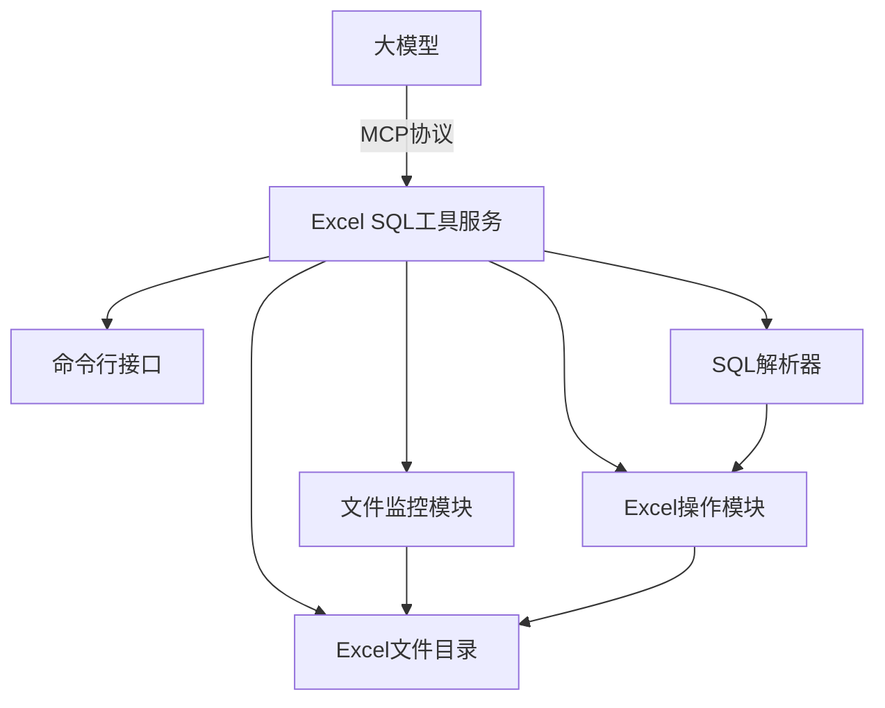

# Excel SQL工具设计方案

## 1. 概述

本方案旨在设计一个Excel SQL工具，允许用户通过SQL语句操作Excel文件，类似于数据库操作。该工具将作为一个服务运行，支持对指定目录下的Excel文件进行增删改查操作。

## 2. 技术选型

- **NPOI库**: 用于读取和写入Excel文件(.xlsx格式)
- **.NET Framework**: 项目中已包含相关DLL文件
- **SQL解析器**: 用于解析SQL语句
- **MCP协议**: 用于与大模型通信

## 3. 功能需求

### 3.1 核心功能
1. 通过命令行启动服务: `ExcelSqlTool.exe <dir>`
2. 监控指定目录下的所有Excel文件
3. 支持SQL语句操作Excel表格
4. 支持获取工作表的建表语句
5. 支持获取所有工作表的名称
6. 支持对工作表进行字段操作
7. 支持通过建表语句创建Excel表格

### 3.2 SQL支持功能
1. SELECT查询
2. INSERT插入
3. UPDATE更新
4. DELETE删除
5. ALTER TABLE修改表结构
6. CREATE TABLE创建表
7. SHOW TABLES显示所有表

## 4. 系统架构设计

### 4.1 整体架构


### 4.2 模块设计

#### 4.2.1 命令行接口模块
- 解析命令行参数
- 启动服务并监听指定目录

#### 4.2.2 文件监控模块
- 监控指定目录下的Excel文件变化
- 自动加载新文件或更新修改的文件
- 移除已删除的文件

#### 4.2.3 SQL解析器模块
- 解析SQL语句
- 将SQL操作转换为Excel操作指令
- 支持SELECT、INSERT、UPDATE、DELETE语句
- 支持DDL语句（CREATE TABLE、ALTER TABLE等）
- 语法验证和错误提示

#### 4.2.4 Excel操作模块
- 使用NPOI库读取和写入Excel文件
- 实现增删改查操作
- 实现表结构操作

## 5. 数据模型设计

### 5.1 Excel文件模型
```
ExcelFile
├── FileName: string (文件名)
├── Path: string (文件路径)
├── LastModified: DateTime (最后修改时间)
└── Worksheets: Dictionary<string, Worksheet> (工作表集合)
```

### 5.2 工作表模型
```
Worksheet
├── Name: string (工作表名称，用作表名)
├── Headers: List<Column> (列定义)
├── DataRows: List<Dictionary<string, object>> (数据行)
└── FilePath: string (所属文件路径)
```

### 5.3 列模型
```
Column
├── Name: string (列名)
├── DataType: string (数据类型)
└── Index: int (列索引)
```

## 6. SQL语法支持

### 6.1 查询操作
```sql
-- 查询所有数据
SELECT * FROM Sheet1;

-- 条件查询
SELECT * FROM Sheet1 WHERE ID = 1;

-- 指定列查询
SELECT ID, Name FROM Sheet1;
```

### 6.2 插入操作
```sql
-- 插入数据
INSERT INTO Sheet1 (ID, Name, Type) VALUES (1, 'Test', 'Type1');
```

### 6.3 更新操作
```sql
-- 更新数据
UPDATE Sheet1 SET Name = 'NewName' WHERE ID = 1;
```

### 6.4 删除操作
```sql
-- 删除数据
DELETE FROM Sheet1 WHERE ID = 1;

-- 删除所有数据（保留表结构）
DELETE FROM Sheet1;
```

### 6.5 表结构操作
```sql
-- 获取建表语句
SHOW CREATE TABLE Sheet1;

-- 显示所有表
SHOW TABLES;

-- 添加列
ALTER TABLE Sheet1 ADD COLUMN NewColumn VARCHAR(255);

-- 删除列
ALTER TABLE Sheet1 DROP COLUMN OldColumn;
```

### 6.6 创建表操作
```sql
-- 创建新表
CREATE TABLE NewSheet (
    ID INT,
    Name VARCHAR(255),
    Type VARCHAR(50)
);
```

## 7. 目录结构和表名规则

### 7.1 目录结构
- 工具监控指定目录下的所有.xlsx文件
- 每个Excel文件可以包含多个工作表
- 每个工作表作为一个独立的表进行操作

### 7.2 表名规则
- 表名直接使用工作表名称（Sheet Name）
- 不使用文件名作为表名
- 同名工作表在不同文件中可能会产生冲突，需要处理

## 8. 实现细节

### 8.1 表头处理
- 前3行为表头信息（根据用户需求）
- 第1行为列名
- 第2行为数据类型（可选）
- 第3行为描述信息（可选）
- 第4行开始为数据行
- 表头信息包括列名和数据类型推断

### 8.2 数据类型推断
- 根据列中数据的内容推断数据类型
- 支持的数据类型：字符串、整数、浮点数、日期等

### 8.3 文件同步机制
- 定期检查文件修改时间
- 当检测到文件变化时，重新加载文件内容
- 写入操作后及时保存到文件

### 8.4 错误处理
- SQL语法错误处理
- 文件读写错误处理
- 数据类型不匹配处理
- 表或列不存在错误处理
- 并发访问冲突处理
- 内存不足处理

### 8.5 日志记录
- 记录SQL执行日志
- 记录文件操作日志
- 记录错误和异常信息
- 提供日志级别设置

## 9. MCP协议接口设计

### 9.1 启动服务
```bash
ExcelSqlTool.exe <directory_path>
```

### 9.2 MCP消息格式
```json
{
  "method": "execute_sql",
  "params": {
    "sql": "SELECT * FROM Sheet1"
  }
}
```

### 9.3 响应格式
```json
{
  "result": [
    {"ID": 1, "Name": "Test", "Type": "Type1"},
    {"ID": 2, "Name": "Test2", "Type": "Type2"}
  ]
}
```

### 9.4 支持的MCP方法
1. `execute_sql`: 执行SQL语句
2. `get_tables`: 获取所有表名
3. `get_create_table`: 获取建表语句
4. `refresh`: 刷新文件缓存

## 10. 项目依赖库

项目中已经包含了以下NPOI相关库文件：
- NPOI.dll: 核心库，提供基础的Excel操作功能
- NPOI.OOXML.dll: 用于处理Office Open XML格式（.xlsx）
- NPOI.OpenXml4Net.dll: Open XML格式支持
- NPOI.OpenXmlFormats.dll: Open XML格式定义
- ICSharpCode.SharpZipLib.dll: 压缩库，NPOI依赖此库处理文件压缩

## 11. 安全考虑

### 11.1 文件访问安全
- 限制只能访问指定目录下的文件
- 防止路径遍历攻击

### 11.2 SQL注入防护
- 对SQL语句进行严格的解析和验证
- 参数化查询防止注入攻击

### 11.3 数据安全
- 提供事务支持，确保数据一致性
- 在写入文件前进行数据验证

## 12. 性能优化

### 12.1 缓存机制
- 缓存已加载的Excel文件
- 定期检查文件更新

### 12.2 批量操作
- 支持批量插入、更新、删除操作
- 减少文件I/O操作次数

### 12.3 索引优化
- 为常用查询字段建立索引
- 提高查询效率

## 13. 使用示例

### 13.1 启动工具
```bash
ExcelSqlTool.exe ./XLSX
```

### 13.2 查询数据
```sql
SELECT * FROM Actions;
SELECT ID, Name FROM Build WHERE Status = "Active";
```

### 13.3 插入数据
```sql
INSERT INTO Actions (ID, Name, Type, Description, Status) VALUES (1001, "NewAction", "System", "New action description", "Active");
```

### 13.4 更新数据
```sql
UPDATE Build SET Status = "Completed" WHERE ID = 101;
```

### 13.5 删除数据
```sql
DELETE FROM Actions WHERE ID = 1001;
```

### 13.6 表结构操作
```sql
SHOW TABLES;
SHOW CREATE TABLE Actions;
ALTER TABLE Actions ADD COLUMN Priority INT;
```

### 13.7 创建新表
```sql
CREATE TABLE NewSheet (
    ID INT,
    Name VARCHAR(255),
    CreatedDate DATE,
    IsActive BOOLEAN
);
```